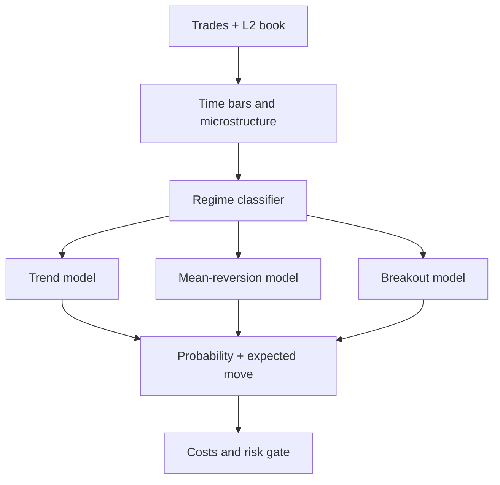

The strongest Pillar Two will not be one “best trader algorithm” or a pile of RSI/MACD indicators. For your scalping bot, I recommend a **regime-dependent ensemble** combining market microstructure, trend, mean reversion and volatility—with separate calibration for crypto and gold.

Your RTX 2060 is more than sufficient: Pillar Two mainly needs clean tick/order-book data and CPU-based statistical computation, not a GPU.

## Recommended Pillar Two architecture



### 1. Market-microstructure features

These are more valuable for scalping than traditional indicators alone:

* Bid–ask spread in basis points.
* Microprice.
* Order-book imbalance at several depth levels.
* Order-flow imbalance.
* Aggressive buy/sell volume and cumulative volume delta.
* Trade-arrival intensity.
* Quote update/cancellation intensity.
* Short-term realized volatility.
* Book depletion and refill speed.
* Difference between last trade, midpoint and microprice.

For example:

$$
\text{Microprice} =
\frac{Ask \times BidQty + Bid \times AskQty}
{BidQty + AskQty}
$$

The Coursera [Market Microstructure](https://www.coursera.org/learn/market-microstructure) course is my strongest first recommendation. It covers liquidity, price discovery, transaction costs, order flow, market depth and algorithmic trading. ([Coursera][1])

### 2. Regime classifier

Before choosing a direction, classify the current market:

* `TRENDING`
* `RANGING`
* `BREAKOUT_COMPRESSION`
* `HIGH_VOLATILITY`
* `ILLIQUID`
* `NEWS_SHOCK`
* `UNTRADEABLE`

Use interpretable inputs initially:

* EMA slope and separation.
* Efficiency ratio.
* ADX.
* ATR and realized volatility percentiles.
* Bollinger bandwidth.
* Spread and depth percentiles.
* Trade intensity.
* Return autocorrelation.

A signal that works in a range will often lose money in a trend. The classifier decides which algorithm is allowed to participate.

### 3. Three complementary signal models

#### Trend/momentum

Use:

* EMA slope and alignment on 5-second, 15-second and 1-minute bars.
* Donchian breakout.
* Price relative to session VWAP.
* Higher-high/lower-low structure.
* Order-flow confirmation.
* Volatility-adjusted momentum.

ADX should indicate trend strength; it should not independently choose direction.

#### Mean reversion

Use only in confirmed ranging regimes:

* VWAP deviation z-score.
* Bollinger deviation.
* Short-horizon return z-score.
* RSI as secondary confirmation.
* Microprice moving back toward midpoint.
* Exhaustion in aggressive order flow.

Never buy merely because RSI is oversold. Require spread, volatility and order-flow conditions to agree.

#### Breakout

Use:

* Range or volatility compression.
* Donchian/high-low boundary.
* Increasing trade intensity.
* Book imbalance in the breakout direction.
* Aggressive volume confirmation.
* Retest or persistence filter to reject one-tick false breakouts.

### 4. Produce probability, not indicator votes

Each model should output something like:

```json
{
  "direction": "LONG",
  "probability": 0.64,
  "expected_move_bps": 9.2,
  "horizon_seconds": 45,
  "regime": "TRENDING"
}
```

Only permit entry when:

$$
\text{Expected Move} >
\text{Fees} + \text{Spread} + \text{Slippage} + \text{Safety Margin}
$$

Then require:

* Fresh Pillar One agreement.
* Pillar Two probability above a calibrated threshold.
* Sufficient expected movement after costs.
* Risk-engine approval.
* Fresh and synchronized market data.

Avoid arbitrary formulas such as `RSI + MACD + ADX = score`. Calibrate probabilities with out-of-sample data using logistic regression, isotonic regression or Platt scaling.

## Crypto-specific model

Start with `BTC_USDT`, then test `ETH_USDT`.

Add:

* Spot–perpetual basis.
* Funding rate and time until funding.
* Open-interest change.
* Liquidation intensity, if reliable data exists.
* Cross-exchange BTC prices.
* Perpetual premium/discount.
* Weekend and low-liquidity regimes.

Crypto trades continuously, but liquidity and participant behavior change substantially across Asian, European and US sessions.

## Gold/XAU model

Gold needs a separate model and parameters. Do not train one combined BTC/XAU signal model initially.

Useful Pillar Two inputs include:

* Ourbit gold order book and trades.
* COMEX gold or a reliable spot-gold reference.
* Difference between Ourbit price and external reference price.
* US dollar index or broad dollar proxy.
* US real-yield proxy.
* Session: Asia, London, London–New York overlap.
* COMEX open and settlement periods.
* Volatility around major economic releases.
* Gold/reference-market divergence.

The World Gold Council groups gold drivers into economic expansion, risk and uncertainty, opportunity cost and momentum. ([World Gold Council][2]) CME’s gold material is valuable for understanding benchmark contracts, trading hours, contract sizing and reference-market behavior. ([CME Group][3])

Important: Ourbit advertises precious-metals markets, but its public TradFi page does not expose enough information to confirm the exact `XAU-USDT` specification. ([ourbit.com][4]) Before writing the adapter, retrieve and freeze:

* Exact API symbol.
* Spot, CFD-like or perpetual structure.
* Tick and lot size.
* Contract multiplier.
* Funding or overnight financing.
* Mark and index construction.
* Trading interruptions.
* Maximum leverage.
* Liquidation and ADL rules.

## Best course sequence

### Stage 1 — Trading mechanics

1. **Market Microstructure — Università di Napoli Federico II**

   Your highest-priority course. Concentrate on order flow, liquidity, transaction costs and price discovery. ([Coursera][1])

2. **CME Futures Education**

   Complete the futures foundation, cryptocurrency futures and gold modules. CME also offers a risk-free gold simulator. ([cmegroup.com][5])

3. **Binance Academy**

   Use its free material for perpetual futures, funding, liquidation, order types and crypto mechanics—not as a source of profitable strategies. ([Free Crypto & Blockchain Education][6])

### Stage 2 — Quantitative implementation

4. **Georgia Tech CS 7646: Machine Learning for Trading**

   Covers financial-data processing, strategy implementation, regression, trees, KNN and reinforcement-learning foundations. Its public materials are available online. ([omscs.gatech.edu][7])

5. **Columbia Financial Engineering and Risk Management**

   Useful for derivatives, futures, optimization, model fitting and scenario-based risk management. ([Coursera][8])

Machine learning should come after you have a trustworthy event-driven backtester.

## Books, in recommended order

1. **Trading and Exchanges — Larry Harris**

   The best overall foundation for exchanges, traders, order books, dealers, liquidity and execution. ([Larry Harris][9])

2. **Evidence-Based Technical Analysis — David Aronson**

   Especially relevant because you want rule-based signals. It teaches statistical evaluation, hypothesis testing and how to detect data-mining bias. ([Evidence-Based Technical Analysis][10])

3. **Systematic Trading — Robert Carver**

   Strong for forecast combination, volatility scaling, diversification and risk allocation.

4. **Algorithmic Trading and DMA — Barry Johnson**

   Useful for execution, order types, transaction costs and practical market structure.

5. **Advances in Financial Machine Learning — Marcos López de Prado**

   Read later for purged validation, embargoes, labeling and backtest-overfitting concepts. Do not begin by implementing every technique in it.

## Practical 12-week path

* **Weeks 1–2:** Market microstructure course and Larry Harris.
* **Weeks 3–4:** Implement time bars, spread, microprice, order-flow imbalance and realized volatility.
* **Weeks 5–6:** Implement trend, mean-reversion and breakout models.
* **Weeks 7–8:** Add regime selection and cost-aware probability thresholds.
* **Weeks 9–10:** Build deterministic BTC and XAU replay datasets.
* **Weeks 11–12:** Run walk-forward tests, stress scenarios and shadow paper trading.

Do not optimize for maximum historical profit. Select configurations that remain profitable across neighboring parameters, different months, high-volatility periods, exchange outages, doubled fees, wider spreads and increased latency.

For this repository, the correct next engineering milestone is: **complete the time-based BTC Pillar Two engine, connect it to the continuous paper runtime, and prove it with replay before adding XAU**.

[1]: https://www.coursera.org/learn/market-microstructure?utm_source=chatgpt.com "Market Microstructure"
[2]: https://www.gold.org/goldhub/research/gold-mid-year-outlook-2026?utm_source=chatgpt.com "Gold Mid-Year Outlook 2026: Point break"
[3]: https://www.cmegroup.com/markets/metals/precious/gold-futures.html?utm_source=chatgpt.com "Gold Futures"
[4]: https://www.ourbit.com/tradfi?utm_source=chatgpt.com "TradFi Zone: Access Traditional Assets"
[5]: https://www.cmegroup.com/education/courses/introduction-to-cryptocurrency-futures?utm_source=chatgpt.com "Introduction to Cryptocurrency futures"
[6]: https://www.binance.com/en/academy?utm_source=chatgpt.com "Binance Academy"
[7]: https://omscs.gatech.edu/cs-7646-machine-learning-trading?utm_source=chatgpt.com "CS 7646: Machine Learning for Trading | Online Master of Science in Computer Science (OMSCS)"
[8]: https://www.coursera.org/specializations/financialengineering?utm_source=chatgpt.com "Financial Engineering and Risk Management"
[9]: https://global.oup.com/academic/product/trading-and-exchanges-9780195144703?utm_source=chatgpt.com "Trading and Exchanges"
[10]: https://www.wiley-vch.de/en/areas-interest/finance-economics-law/finance-investments-13fi/trading-13fi4/evidence-based-technical-analysis-978-0-470-00874-4?utm_source=chatgpt.com "Wiley-VCH"
